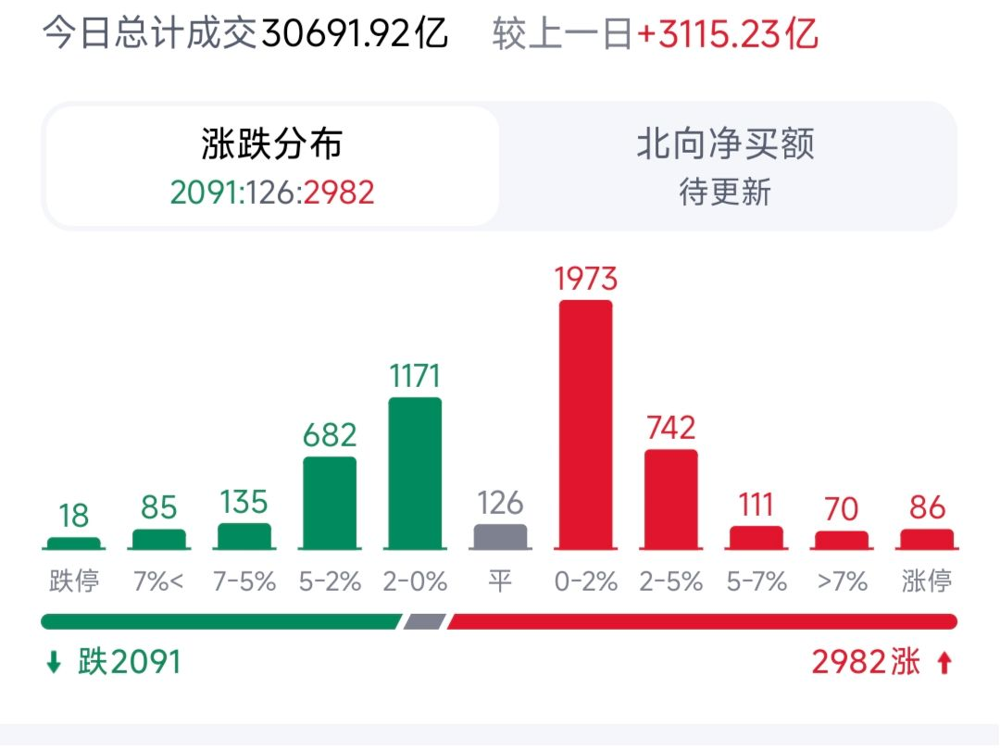
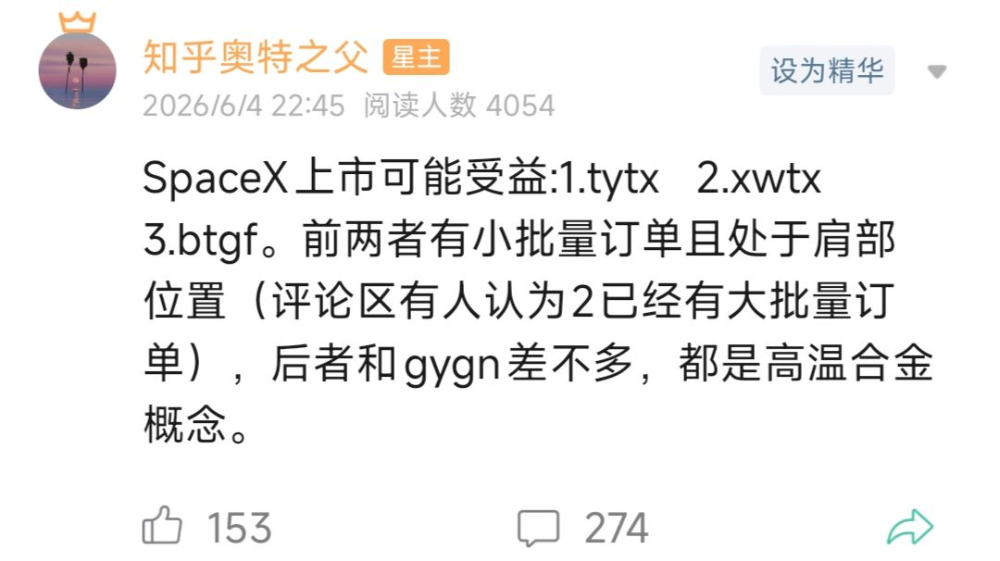

今天大A:

**一.大盘**

大盘跌破了4060的支撑后，趋势就已经走坏。但对绝大多数人来说，走不走坏都没差别，最近三周除了少部分ai相关个股抱团以外，大部分标的都已经阴跌到3600以下的位置，指数失真比较严重。

走坏主要是增量资金暂时不进来+存量资金（zj为主）抽离，场外资金的做多热情需要像924那波一样，有普涨的行情才能起来。但外围最重要的石油问题暂未解决，所以只能等待。

**二.AI链**

昨天博通大跌，仅仅是因为没有上修收入预期。无论是纳指还是大A接下去都要经历巨额的IPO和增发抽血，大A这边，达链的估值都偏高，更不要说一些蹭到概念的伪科技股了。

我上周四已经把ai链给清了，留了点ai应用和联想，中芯。这两天还有一件很重要的事情，就是谷歌发布了gemma4 12b，这个可以在家用笔记本电脑上跑256k上下文的模型。

这个模型解决了很多以往本地化模型的痛点，支持音频图片等输入，也就是说未来，ai刚需，一些小模型大部分可以在家用电脑这样的平台就能跑起来。

大A这边，近三周想要不亏钱的唯一办法是把所有持仓换成芯片和半导体，但是最近赚钱效应也开始变淡，上一波解决的接盘问题是让老登股抽血过去的散户接，下一波卖给谁呢？

**三.机器人**

机器人是未来的一个必然趋势，但现在离大规模落地还非常遥远，所以有个底仓很重要，没到低点也没必要all in。这两天老黄讲话+白毛股神吹票后，今天机器人板块走得还可以，稍微回升了点儿。

未来，机器人是一定会代替大部分工人的岗位的，一开始是车间流水线作业。很多人说，工业机器人不行么？不是的，很多小型企业没有资金去做大型流水线，但是你把机器人放在工位上，做一些简单培训编程，就可以代替一个初级工人。浙江这边，五月已经开始有机器人做缝纫机工人了。

**四.SpaceX上市**

空叉上市，对大A的商业航天肯定会有带动效应，尤其是有业务往来的通讯行业。通宇，信维这种都有机会，尤其是昨天回落到了肩部位置。

今天走得还可以。

正常来说，短线的，有消息催化+碰boll下轨+头肩的肩部位置，反包的概率大。当然，一切都有概率，资金不青睐再好的概念也没用，比如海峡停运强受益的煤化工。

**五.整体策略**

现在，大部分股友都比较煎熬，主要是整个市场的赚钱效应没了，成交量三万亿，个股却均匀地下行。主要原因还是消费上不去……同时硅基的热烈进一步使得碳基的消费前景寡淡。

在这种既定前景下，平减（均匀减持手上的标的）来控制好仓位显得尤为重要，这样就算下去再买回，也可以减少不少成本，相当于拿一部分仓位做t。这个之前停更前也最后一次收评也说了。

这部分资金什么时候打出呢？一个是大盘足够低的时候，比如碰前低3800，另一个是海峡通航，我们是工业国石油净进口国，这次迟迟不通对制造业的短期打击还是很大的。
