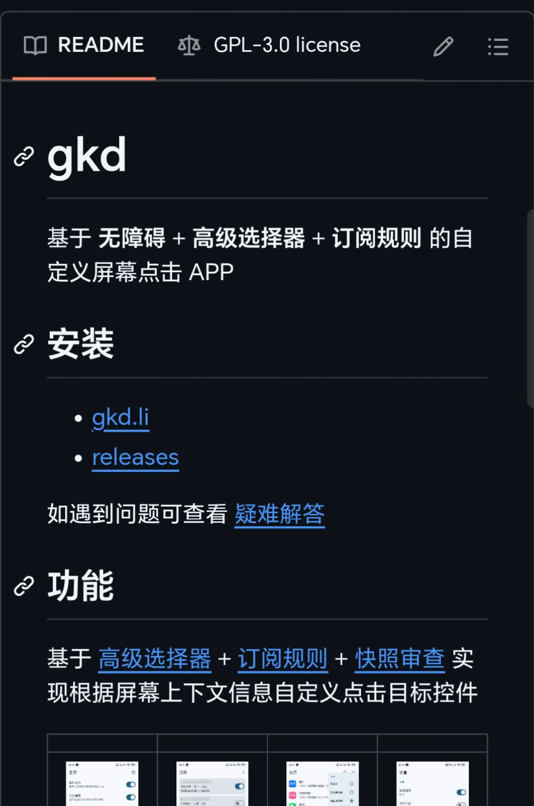

GitHub搜gkd

[https://github.com/gkd-kit/gkd](https://www.zhihu.com/question/15501018354/answer/undefined)

很好用，界面简洁，保活能力非常强，重启也不掉。个人认为比李跳跳还好用。

第一次使用可以导入一下大佬们做的规则

[Build software better, together](https://www.zhihu.com/question/15501018354/answer/undefined)
