## **从巅峰到发疯，只需要100倍杠杆的合约交易。**

## 从“合约天才”到“杠杆赌徒”，18岁从2000块RMB做合约赚到8位数，在中文币圈，如果说谁最像“加密版利弗莫尔”，很多人会想到一个名字凉兮。而凉兮的本名，叫耿至宇。他几乎是整个中文币圈最具争议性的交易员之一。

**有人把他视为：“天赋型交易怪物”。也有人认为：“他只是一个被杠杆吞噬的赌徒。”**

但无论喜欢还是讨厌，你都无法否认耿至宇的经历，本身就是这一轮加密时代最极端、最疯狂、也最病态的缩影。

**神话终究是会破灭！这一刻，正式被法院开启了：悬赏公告！**

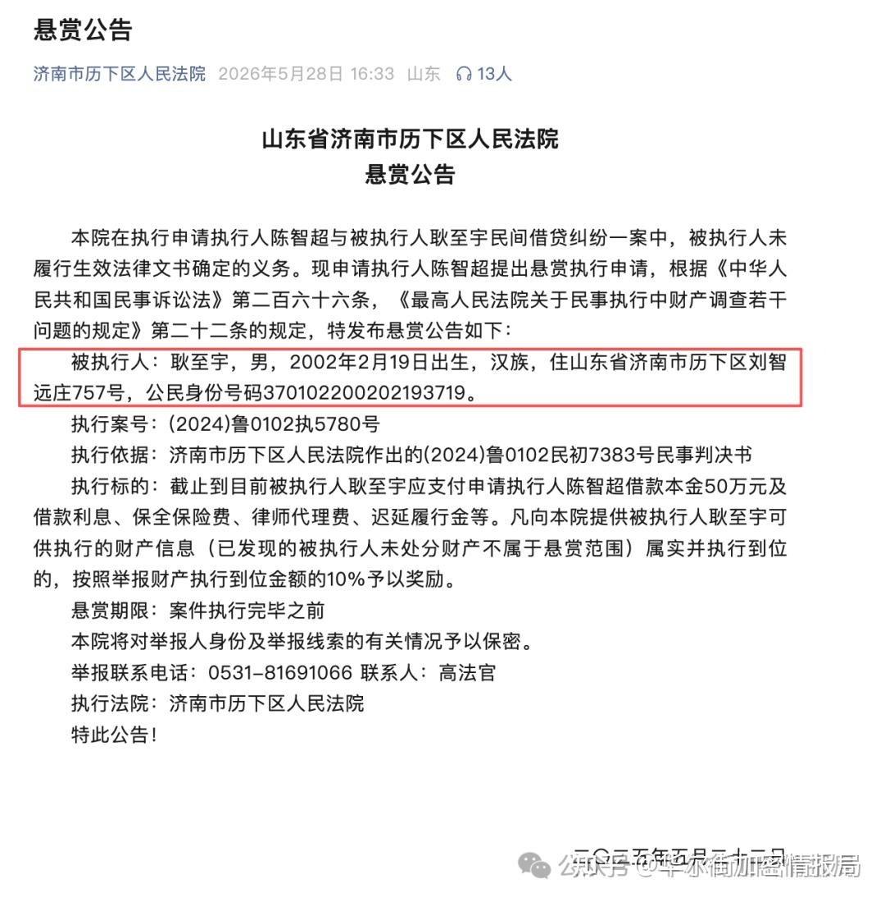

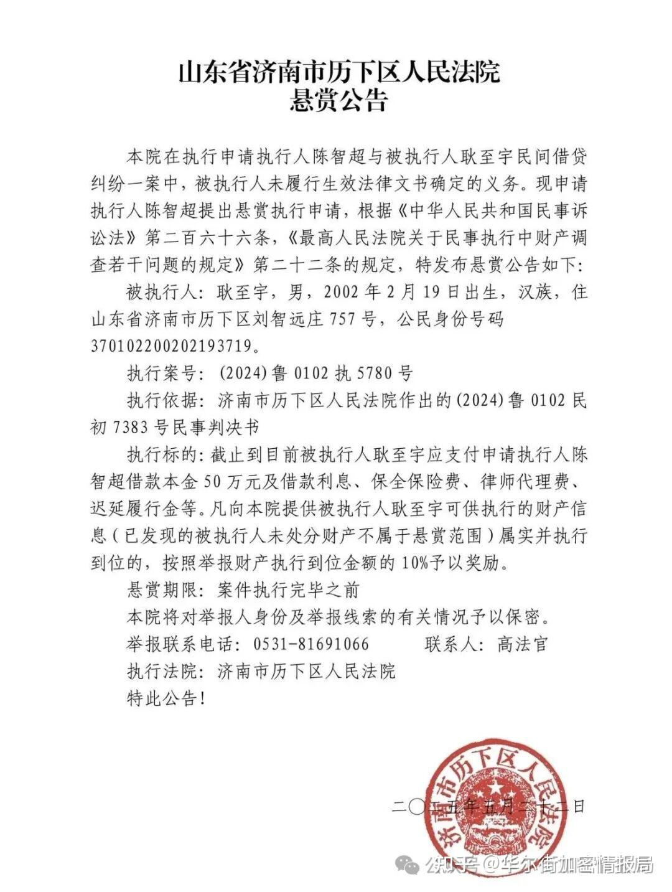

## **凉兮是谁？**

本名：耿至宇

币圈ID：凉兮将军

**外号：币圈空头之王、合约战神、万倍交易员**

公开资料显示，他早年曾是少年游泳运动员，达到国家准一级水平。后来又沉迷电竞，《王者荣耀》曾打到国服顶尖段位。

从小的竞技环境，塑造了他极端的胜负欲。这也是后来他会沉迷“高杠杆合约”的核心原因。因为合约交易，本质上和竞技游戏极其相似。

目前x上仅存的账号：凉兮将军里，其余的均被封禁了。

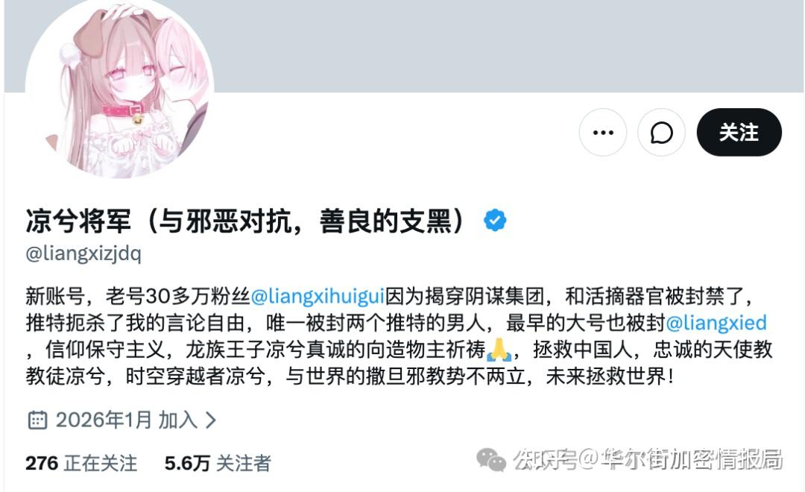

##   

## **真正让凉兮封神的：2021年“519大崩盘”**

凉兮真正成名，是在2021年5月19日那场史诗级暴跌。那一天，BTC单日暴跌超30%；全网数百亿美金爆仓；无数人财富归零，其中就有我，我感觉凉兮赚的就是我亏的。

**而19岁的凉兮，选择了“100倍做空。”，那一次的我是，3倍做多BTC在42000美金，结果一顿火锅吃完就爆仓清算了。而凉兮却赚了好多！**

**这也是至今难忘的痛。**

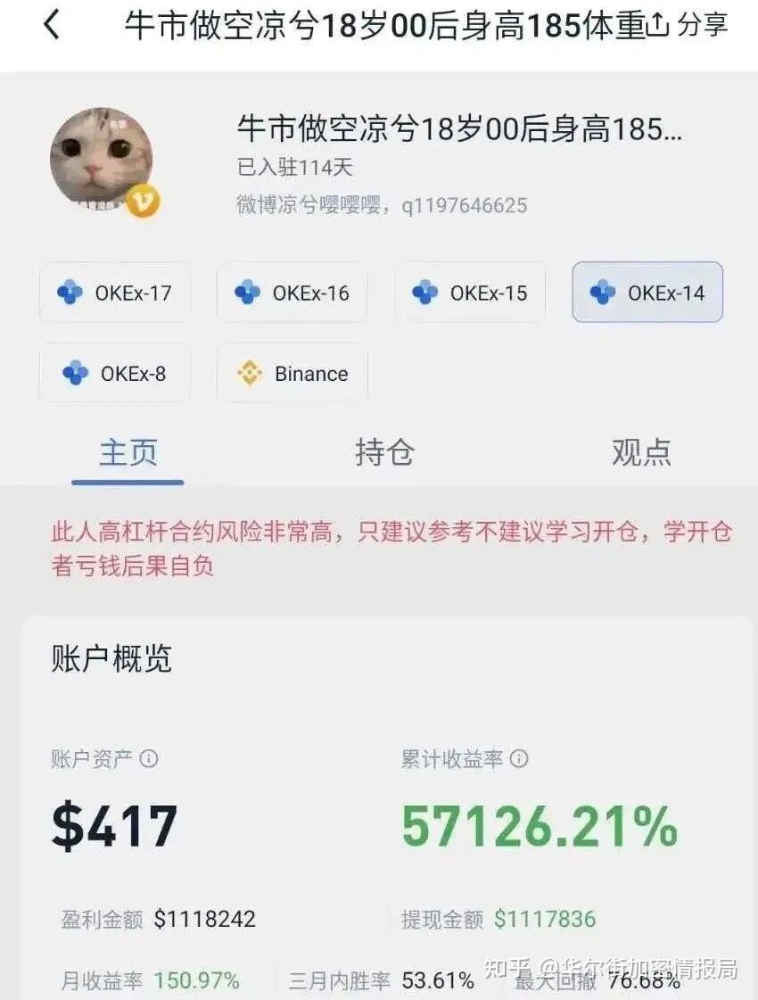

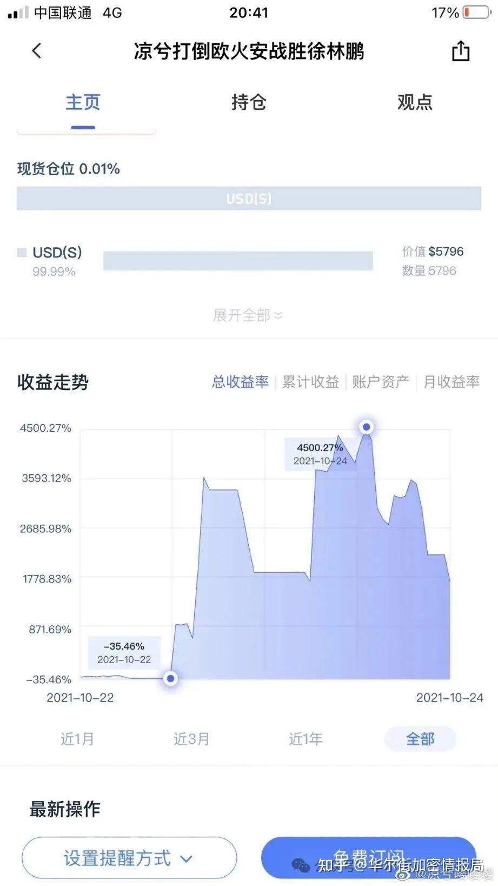

他最初本金只有两千元左右，随后通过连续滚仓、极限杠杆，在“5·19”行情中疯狂获利。“19岁合约战神”的神话开始诞生。

**但很多人没意识到这并不是“价值投资”。这其实是极端波动时代里的概率幸存者。**

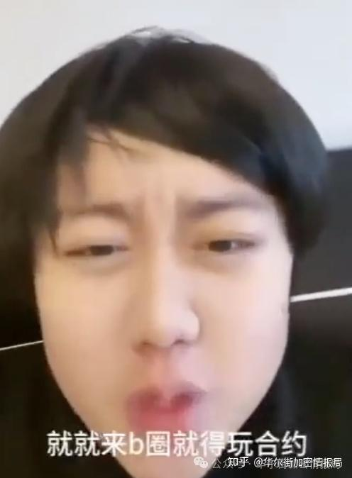

##   

## **为什么凉兮会被整个币圈疯狂围观？**

因为他满足了币圈最原始的欲望“一夜暴富神话。”中文币圈一直有一种极强的情绪：不想慢慢赚钱、长期复利。**只想一把翻身，这是普通人和韭菜最想要的！**

**而凉兮，刚好就是这个时代的投影。他代表的是：“普通人幻想中的暴富模板。”**

几千块做到几千万，100倍杠杆，一天财富自由。这会让无数年轻人产生错觉：“我也可以。”

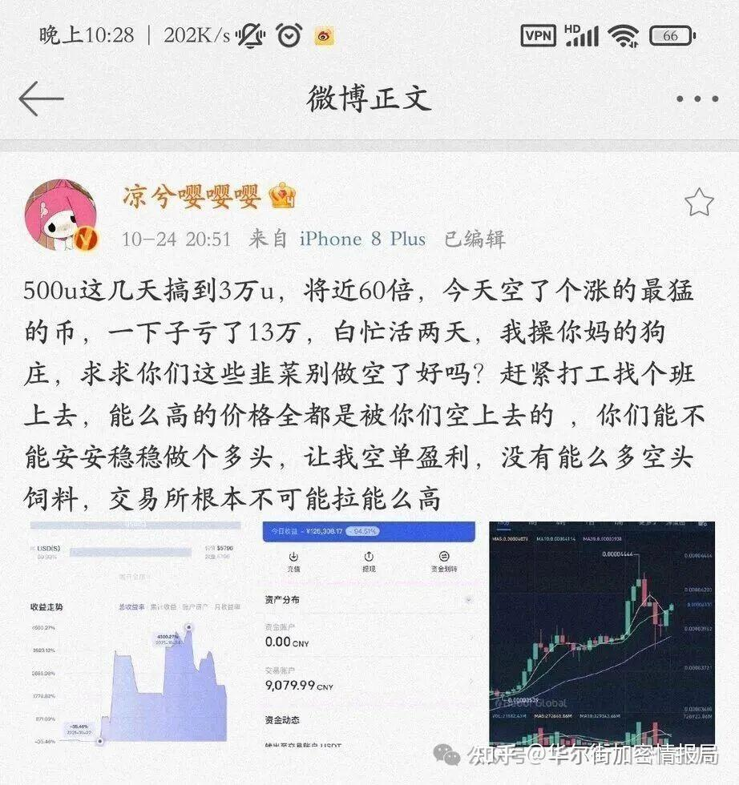

最终，很多顶级高杠杆交易员都会进入一种状态：“无法正常生活。”这也是为什么，全球最顶级的职业交易员，反而越来越低频。因为真正的大资金最后都会发现稳定，才是最难的。

现实是大部分人只会学到他的“杠杆”，学不到他的“天赋”。最后结果就是无数人死在合约里。同时这也是毁掉一个少年的最好方式，不信你看看凉兮过去5年的变化！

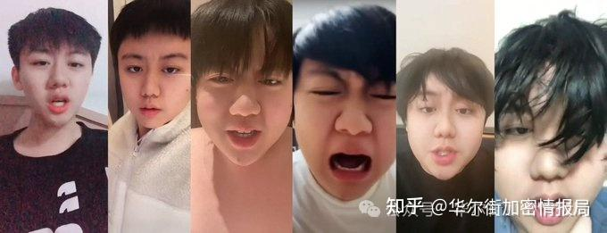

**高频和高倍，一定是把你退圈的最快的方式。**

因为高杠杆交易有一个宿命你可以躲过99次，但只要一次方向错了，之前所有盈利都会被吞掉。

**高频，会刺激你的多巴胺分泌，让你兴奋**，但是亏损后，你会焦虑，然后继续交易，加仓，最后爆仓！

**高倍，放大了你的盈利预期，让你觉得你会暴富**，很多小交易所甚至有1000倍的杠杆，波动0.1%，就会面临清算，还不算资金费率，你的那点保证金，能撑多久？

**凉兮，最后就是到处借贷，私人借贷、网上公开借贷、孙哥还借给了1万usdt，直播带单，各种爆粗口。**

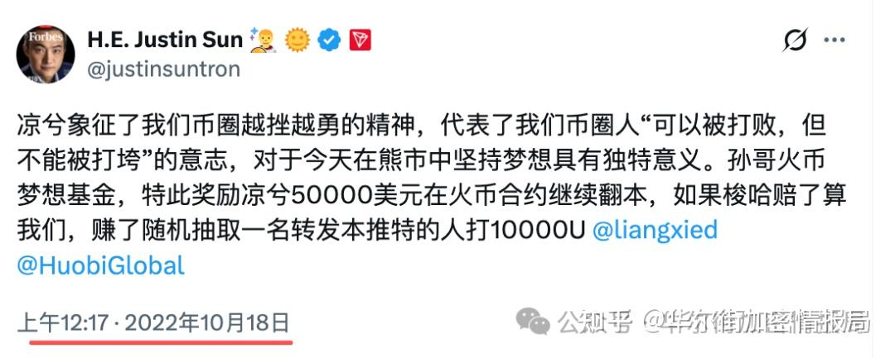

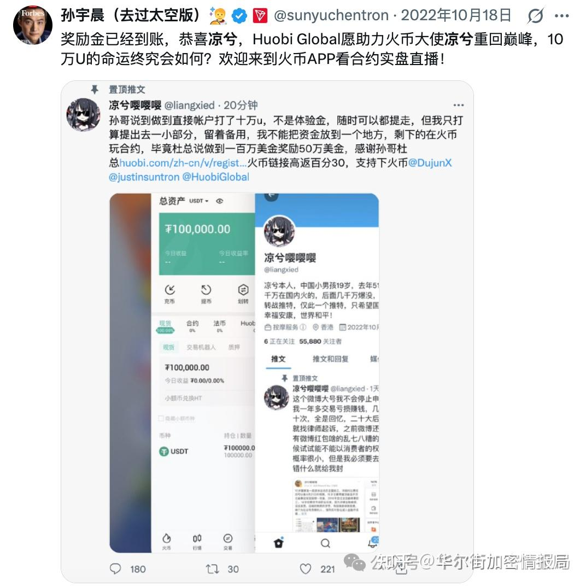

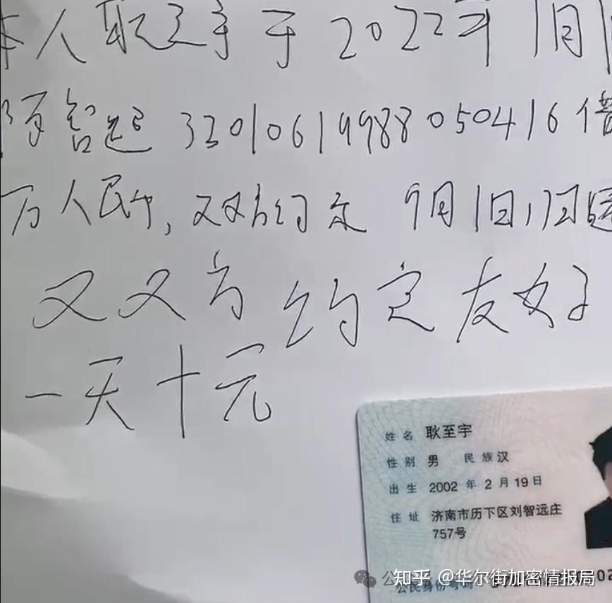

**一方面，交易所愿意给他资金玩**，是因为你在别人的游戏场里，玩游戏根本不怕你赚，交易所看中的是，你还有流量，还能带进来用户玩。

**另外一方面，高倍交易，频繁交易，直播交易，**会让凉兮去寻找久违的成就感，**一个经历过山顶的人，怎么会轻易的挨打认错呢？**

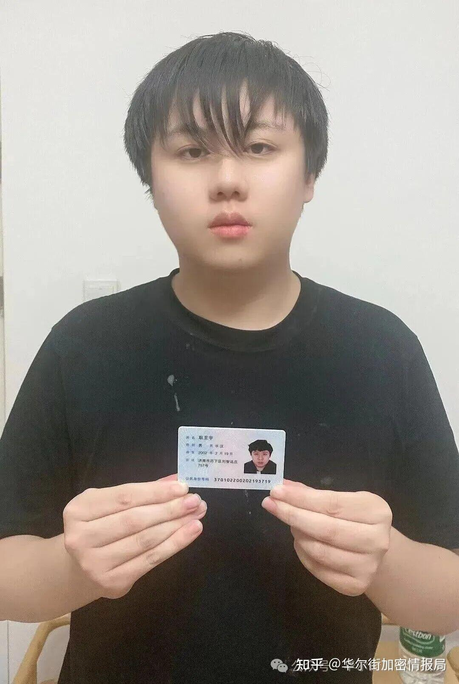

很多年轻人看到凉兮，会觉得：“太牛了”。但真正成熟的投资者看到凉兮，想到的其实是“风险。”因为真正能长期活下来的交易员，往往都越来越保守。而不是越来越疯狂，凉兮的经历，本**质上不是“财富自由故事”。而是一个高波动时代里，年轻人被杠杆与流量共同吞噬的故事。他既是受益者，也是受害者。**

##   

**凉兮这种人物，天然会重新成为流量中心。**

**因为币圈从来不缺神。但真正缺的是活得久的人。**

耿至宇的故事，其实不是一个人的故事。

**而是整个加密时代的缩影。这个行业会不断制造：暴富、神话、传奇**

但历史最终会证明真正穿越周期的人，往往不是最激进的人。而是能控制欲望的人。

**深度观察 · 独立思考 · 价值不止于价格。**

星标#华尔街加密情报局，好内容不错过**⭐**

**最后：**文中的很多观点，都是代表我个人对市场的认知判断，并不对你的投资构成建议
