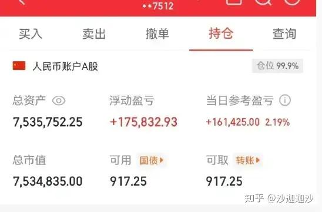

我拿的最久的长江电力，中国银行，贵州茅台，近8年了，中国银行已经翻一倍了。初衷就是吃股息=养老金。目前22万/年，已经不上班6年了。

在这之前，有拿过4年的金风科技，16的成本，每年也吃股息，18左右出掉，那时盈利12万。

长线我还是做不来，中短线比较适合我这种选手，所以首选股息率+高的，业绩稳定+的，不图暴富，但就安稳。

说说我自己吧！

在股市里，庄家往往凭借手中所掌握的资金优势、信息优势等有利条件影响股价，以获取利润。庄家大多数时间是在与散户博弈，庄家要赢利就要从散户的口袋里“抢”钱。在这场博弈中，庄家为了成功地“抢”到钱，或者说为了“抢”到更多的钱，常常穷尽其所能。散户要想在股市中获利，必须了解掌握庄家这条股海里“大船”的特性，才能够借庄家之船，以最小的代价获取最大的收益。

正如彼得·林奇所说：“不进行研究的投资，就像打扑克不看牌一样，必然失败。”对于散户而言，如果能够猜透庄家的坐庄思路，了解庄家的坐庄手法，看透庄家操作中的技术特点，就可以有针对性地制定跟庄策略。散户跟庄获利，不是一两天能练就的，必须认真学习相关知识，掌握庄家坐庄的规律，不断提高对股市以及坐庄的认识，才能完善自己的操作理念，提高自己的操作技巧，从而成为股市中赢利的少数人。

### 不废话，直接讲干货！

1、首先我们要知道筹码分别有三个颜色组成，分别为红色，蓝色以及灰色的一个跟柱状图形组成，分别代表着获利盘，套拉盘，而柱子的长短代表着在这个价位的筹码堆积情况，柱子越长，说明成交量的就越大，筹码也就越多了，柱子最集中的一部分，就跟山峰一般，这个也就叫做筹码峰，也就是绝大多数人的持仓成本！

2、主力想要吸筹的时候，一般都是小心翼翼的，如果一只股票长期下跌之后，动能开始越来越弱，开始有企稳回升的迹象，股价通常都会开始缓慢的上扬，筹码的分布红色获利盘会出现逐步的增多，为了防止被发现，这个阶段一定是非常缓慢的，温和的方式吸筹，成交量显示堆量以及逐步的上升，正常都不会大涨大跌，这种也是正常的吸筹方式。

3、主力吸筹的第二种方式，因为短期的吸筹股价也将会有所拉高，如果一下子拉太高，那么后面的成本就会太高，导致后续拉升比较吃力，这个时候将会出现一种慢涨快跌的方式，一般这个时间会在7个交易日以内，股价缓慢拉升起来之后开始快速的进行下跌，一般都会反复的进行几次，以便拿到低价的便宜筹码，盘面上可以看到K线呈现出一个个小尖尖的形态，这种形态也叫做“牛长熊短”，这个就是经典的主力打压吸筹的迹象，成交量显示出拉升放量，回踩缩量的形式，筹码显示也是逐步的增加。

4、主力吸筹的第三种方式，这种的话容易造成恐慌的性质，这种后期的拉升幅度一般都会比较大，个股在横盘震荡的区间，某一天拉升突破箱体之后回落继续震荡，随后出现快速的下跌破位，跌破箱体下沿，呈现出一个“坑”一般，但是成交量却是显示出缩量的，随后在短时间内拉升回到箱体附近，这时候的成交量也是呈现出放量的，筹码出现一根长长的柱子，形成筹码峰，这个也是区别是真摔还是假摔的关键了！

5、主力拉升后如何判断出货的情况，如果股价经过一波拉升后到达了高位，但是底部的筹码峰却开始不断的减少，甚至消失，伴随着成交量的放大股价却出现滞涨，高位放出的量甚至达到了5倍以上，或者换手率在高位也超过了20%以上，股价随后开始下跌，筹码峰也不断的下移，这个时候就是主力把手中的筹码换给了散户手中，这个时候就要高位落袋止盈。

6、最后给大家分享一个小技巧，通常如果股价在底部盘整的时间够久，底部的换手率如果达到300%或者以上，也可以判断出主力吸筹基本完毕，搭配热点题材或者大盘坏境良好，那也将会迎来直接的拉升阶段。其实股票背后都是人的操作，不同的就是主力与散户，如果你能领悟筹码背后的含义，在主力吸筹的时候发现踪迹，那么你之后的操作也将会更加的顺畅，为了方便大家更好地理解筹码的分布情况，我也给大家整理好了一些图文的形式，喜欢的朋友，建议大家收藏保存起来。

###   
一、核心理念：大管小、小顺大，顺序绝对不能乱

炒股就像打仗，大周期是战略，小周期是战术。战略错了，战术再精妙也是白搭；战略对了，战术只要不出大错，大概率能赢。

这套战法的铁律只有一条：分析顺序不可逆，必须从大到小，月线→周线→日线→60分钟→15分钟→5分钟，逐级看、逐级验证。

• 为啥不能反过来？你想啊，月线管1-3年的大趋势，周线管1-3个月的波段，日线管1-2周的行情，小周期只是大趋势里的小浪花。

• 要是先看5分钟、15分钟，天天被短线波动牵着走，金叉就追、死叉就割，完全不管月线是多头还是空头，这不叫炒股，这叫“送钱”。

• 只有先定好大方向，再在小周期里找精准买卖点，才是顺势而为，胜率才能翻几倍。

再记牢一个关键原则：大小周期冲突时，小周期必须服从大周期。月线空头、周线走弱，哪怕日线、60分钟金叉再漂亮，也只是弱势反弹，绝不能重仓；月线多头、周线走强，小周期偶尔死叉，只是回调洗盘，反而是低吸机会。

### 二、六周期分工：每个周期管什么，一眼看懂

六个周期各有分工，就像球队里的不同位置，各司其职、配合默契，才能打赢胜仗。我把每个周期的作用、判断标准、实战意义，一次性讲透，不用再瞎琢磨。

**1. 月线：定牛熊，管1-3年（战略核心）**

月线是所有周期的“根”，级别最大、信号最稳，几乎没有骗线。它决定个股是长期走牛，还是长期走熊，是我们能不能重仓、能不能拿长线的根本依据。

**• 核心看两点：MACD在零轴上方还是下方，红柱绿柱的变化。**

• 零轴上方（多头）：大趋势向上，属于牛市格局。不管小周期怎么回调，都是上车机会，中线、长线都能放心做，这种票最容易出翻倍牛股。

• 零轴下方（空头）：大趋势向下，属于熊市格局。任何反弹都是减仓、逃命的机会，别幻想大行情，小仓玩玩就行，保命第一。

• 金叉/死叉：月线金叉，是几年一遇的大底信号；月线死叉，基本就是大顶，必须赶紧躲远。

一句话记死：月线零轴上，才有赚大钱的资格；月线零轴下，再热闹也别贪心。

**2. 周线：看波段，管1-3个月（战术中枢）**

周线是“承上启下”的核心周期，既验证月线趋势，又过滤日线假信号，是我们操作的核心参照。

• 作用：确认月线趋势的强弱，判断中期波段能不能做、空间有多大。

• 月线多头+周线零轴上金叉/红柱放大：强势波段，重仓参与，拿稳吃主升。

• 月线多头+周线零轴下死叉/绿柱收缩：短期回调，轻仓做反弹，快进快出。

• 月线空头+周线任何金叉：弱势反弹，绝不恋战，赚点就跑。

周线是“定海神针”，周线趋势没走坏，日线小波动不用慌；周线一旦走弱，日线再涨也是诱多。

**3. 日线：找波段起止，管1-2周（买卖窗口）**

日线是波段操作的“关键周期”，负责找具体的买卖点，识别顶底背离，确定波段的起点和终点。

• 作用：在周线确定的波段趋势里，找入场和离场的时机。

• 周线多头时：日线零轴上金叉、底背离，是最佳买点；日线顶背离、死叉，是波段卖点。

• 周线空头时：日线所有金叉都是反弹，死叉就是加速下跌，坚决不抄底。

日线信号必须经过周线验证，没有周线撑腰的日线信号，十有八九是陷阱。

**4. 60分钟：看短期动能，管1-3天（日内节奏）**

**60分钟是“短期动能周期”，负责盯日内走势，找短线买卖点，验证日线信号的有效性。**

• 作用：日线信号出现后，用60分钟找更精准的入场、离场时机，避开日内冲高回落、低开低走的坑。

• 日线看涨时：60分钟零轴上金叉、缩量回调，是日内低吸点。

• 日线看跌时：60分钟顶背离、放量滞涨，是日内高抛点。

60分钟不独立决策，只配合日线，细化操作节奏。

**5. 15分钟：抓局部背离，管几小时（信号验证）**

**15分钟是“细节验证周期”，专门抓局部顶底背离，验证中周期信号的可靠性。**

• 作用：当60分钟出现信号时，用15分钟背离确认，避免买在回调高点、卖在反弹低点。

• 比如：日线、60分钟看涨，15分钟出现底背离，说明短期回调到位，入场更安全。

• 日线、60分钟看跌，15分钟出现顶背离，说明短期反弹结束，离场更及时。

15分钟是“过滤器”，帮我们剔除小周期的虚假信号。

**6. 5分钟：定精准点位，管几十分钟（临门一脚）**

**5分钟是最小周期，波动最快，绝对不能用来判断方向，只用于最终确认和精准下单。**

• 作用：前面所有周期都确认信号后，用5分钟找最精准的入场、止损点位。

• 入场：5分钟底背离、缩量止跌，立刻下手。

• 离场：5分钟顶背离、放量跳水，果断出局。

5分钟就是“扳机”，只负责最后一步，不能当“方向盘”。

### 三、周期时间比例：心里有数，操作不慌

不同周期之间有固定的时间比例，记住这个比例，就能预判大周期变化对小周期的影响，不会被短期波动打乱节奏。

• 1根月K ≈ 4-5根周K ≈ 22根日K

• 1根日K ≈ 4根60分钟K ≈ 16根15分钟K ≈ 48根5分钟K

简单说：周线红柱收缩一次，对应日线2-3个小波段；周线一变向，日线最少调整3-5天。懂了这个，就不会在周线多头时，被日线一两天的下跌吓出局；也不会在周线空头时，幻想日线反弹能走成大行情。

### 四、实战三步法：从定方向到下单，一步不差

**战法落地很简单，就三步，严格按顺序做，新手也不会乱，胜率直接拉满。**

第一步：定方向（月线+周线）——能不能做？

先过“保命关”，方向错了，再努力也白搭。

1. 看月线：零轴上方（红柱放大）→ 可以做，积极找机会；零轴下方（绿柱放大）→ 不能做，空仓或小仓。

2. 看周线：月线多头+周线零轴上金叉/红柱扩张 → 重仓波段机会；

月线多头+周线零轴下死叉 → 轻仓短线，快进快出；

月线空头+周线任何信号 → 只观望，不重仓。

第二步：定时机（日线+60分钟）——何时买卖？

方向确定后，找精准买卖窗口。

• 买点：周线多头 → 日线零轴上金叉/底背离 → 60分钟同步金叉/缩量回调 → 准备入场。

• 卖点：周线红柱收缩/顶背离 → 日线死叉/顶背离 → 60分钟同步走弱 → 准备离场。

第三步：定点位（15分钟+5分钟）——精准下单

时机到了，用小周期卡精准点位。

• 入场：15分钟底背离确认 → 5分钟缩量止跌/金叉 → 立即买入。

• 离场：15分钟顶背离确认 → 5分钟放量滞涨/死叉 → 立即卖出。

• 止损：入场后，跌破周线关键支撑位3%，且3天收不回 → 果断止损，不侥幸。

### 五、关键原则：守住纪律，才能稳定盈利

除了步骤，这几条原则必须刻在心里，违反一次，就可能亏一次。

1. 小周期服从大周期：月线空头，周线、日线再强，也只是反弹，绝不重仓。

2. 背离需逐级确认：底背离要从周线→日线→15分钟→5分钟逐级出现，才是有效反转；单一周期背离，大概率是假信号。

3. 不逆趋势操作：大周期多头，只做多、不做空；大周期空头，只观望、不抄底。

4. 动能衰竭就离场：周线红柱持续收缩，说明多头动能耗尽，日线再涨也别贪，赶紧减仓。

5. 无信号不操作：没有周期共振信号，绝不频繁交易，空仓也是一种操作。

### 六、散户最常犯的6个错误，避开就赢一半

我见过太多散户亏在这些误区里，今天一次性列出来，大家对照自查，有则改之。

**1. 只看小周期，忽略大周期：**天天盯5分钟、15分钟，金叉就追、死叉就割，完全不管月线是空头，最后本金越折腾越少。

**2. 顺序颠倒：**从小周期看到大周期，用小周期预判大方向，就像用放大镜看世界地图，完全看不清趋势，被市场反复收割。

**3. 大周期空头时重仓抄底：**月线、周线都走熊，看到日线金叉就满仓，结果抄在半山腰，深套割肉。

**4. 逆大周期操作：**月线空头，却因15分钟底背离重仓买入，最后小反弹后暴跌，亏得很惨。

**5. 周线动能衰竭还死拿：**周线红柱明显收缩，日线还在小幅上涨，以为能继续涨，结果波段见顶，利润回吐大半。

**6. 无信号频繁交易：**不管有没有共振信号，天天满仓进出，手续费亏一堆，还容易踩中假信号。

### 七、核心总结：一句话吃透整套战法

最后把这套MACD周期循环战法浓缩成几句干货，方便大家记忆：

• 月线零轴上才有大机会，零轴下以避险为主。

• 周线是操作核心，日线提供买卖信号，小周期只做验证。

• 大周期定方向，小周期找点位，顺序不能乱，大小要共振。

• 纪律重于预测，严格按步骤执行，不侥幸、不冲动。

**炒股其实没那么复杂，不用学一堆花里胡哨的指标，把MACD六周期循环吃透，严格遵循“大管小、逐级共振”的逻辑，就能避开绝大多数陷阱，抓住每一波主升行情。**

不用追求买在最低点、卖在最高点，只要顺势而为、按信号操作，长期下来，你的胜率、收益、心态都会远超普通散户。

最后

点赞的：一路长红

> 声明：以上所有内容仅作为分享以及交流学习，不作为买卖依据，望大家自行判断，据此操 作，风险自担，股 市有风 险，投 资需谨慎！
